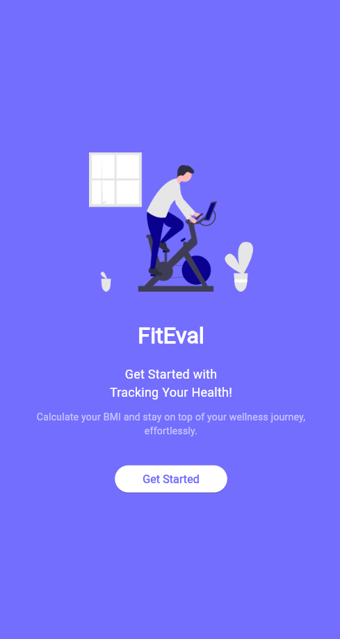
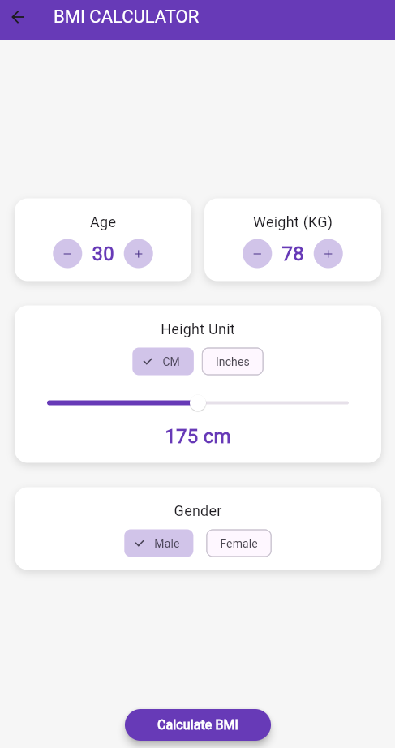
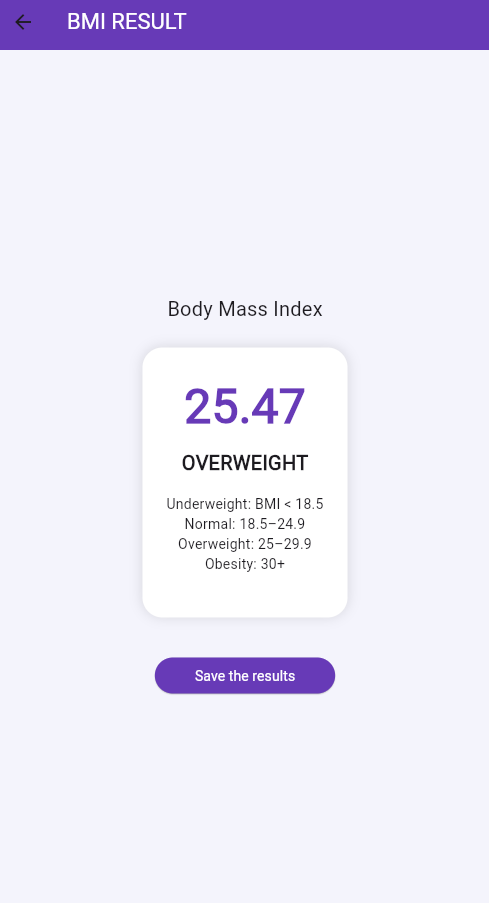

# 🩺 FitEval - BMI Calculator App

**FitEval** is a clean, lightweight BMI (Body Mass Index) calculator built using Flutter. Designed to help users easily calculate and understand their BMI based on age, weight, height, and gender — all in a beautiful and intuitive interface.

## 📱 Features

- 🔢 Real-time BMI Calculation
- 📏 Height input in **CM or Inches**
- 👤 Gender and Age-based input
- 💾 **Save your BMI results** locally
- 🎯 Clear classification (Underweight, Normal, Overweight, Obese)
- ✨ Minimal and responsive UI/UX

## 📸 Screenshots

  
  
  

## 🚀 Getting Started

1. Clone this repo:  
   `git clone https://github.com/yourusername/FitEval.git`

2. Install dependencies:  
   `flutter pub get`

3. Run the app:  
   `flutter run`

## 🧠 Technologies Used

- Flutter + Dart
- SharedPreferences (local storage)
- Material Design

## 📦 APK Release

You can download the latest APK from the [Releases](https://github.com/yourusername/FitEval/releases) section.

## 🛠️ Upcoming Features

- 📊 BMI history chart
- 📝 User profiles
- 📤 Cloud sync

## 🧑‍💻 Developed by

**Abdullah-Al-Mamun Saif**  
Bachelor of CSE, Daffodil International University  
[saif.painn](https://www.instagram.com/saif.painn)
